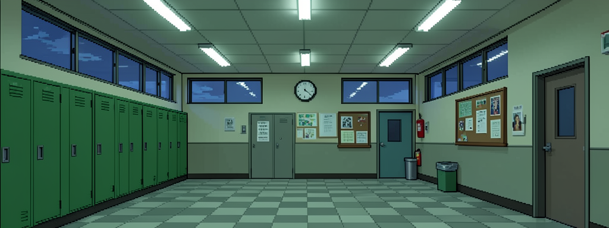
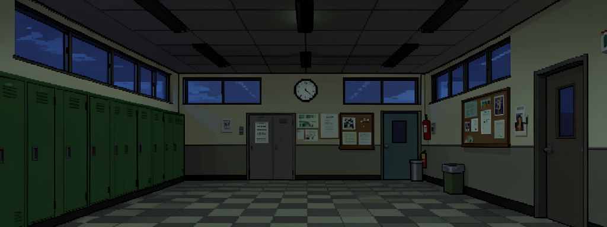
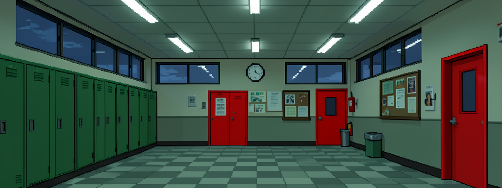
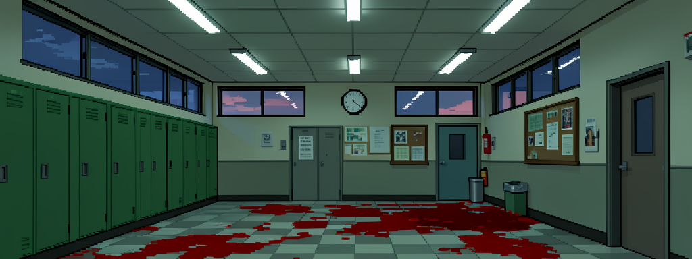

# 《回家路》 The Way Home 🏠

一款2D像素风格横版解谜小游戏，灵感来自《8番出口》(Exit 8)。

> 放学了，你需要穿过10条走廊才能到家。但走廊里有些东西……不太对劲。



## 🎮 玩法

你是一名放学回家的学生，需要依次通过10条学校走廊。

- **第1条走廊**永远是正常的——记住它的样子！
- **第2-10条走廊**可能出现细微的**异常**
- 仔细观察走廊中的每一个细节，判断是否有异常：
  - 🔙 **发现异常** → 按 `A` 从左侧离开（回头）
  - ▶️ **一切正常** → 按 `D` 从右侧离开（继续前进）
- ✅ 判断正确 → 进入下一条走廊
- ❌ 判断错误 → 回到第1条走廊，全部重来！
- 🏆 成功通过全部10条走廊 → **安全到家！**

## 👀 异常类型

走廊中可能出现10种不同的异常，包括但不限于：

| 异常 | 描述 |
|------|------|
| 🔦 灯光异常 | 天花板的灯熄灭了，走廊变暗 |
| 🕐 时钟异常 | 墙上的时钟显示错误的时间 |
| 🪟 窗户异常 | 多出了一扇窗户 |
| 🗑️ 物品消失 | 垃圾桶不见了 |
| 🚪 柜门异常 | 储物柜的门大开着 |
| 📋 公告板异常 | 公告板从墙上掉落 |
| 🔨 墙壁异常 | 墙上出现了裂缝 |
| 🔴 门色异常 | 教室的门变成了红色 |
| 🧯 灭火器消失 | 灭火器不在原位 |
| 🩸 地面异常 | 地板上出现了血迹 |

### 异常示例

**灯光熄灭** — 天花板的灯全部关闭，走廊一片昏暗：



**门变红色** — 原本灰色的门变成了刺眼的红色：



**地面血迹** — 地板上出现了大片不明红色液体：



## 🕹️ 操作

| 操作 | 键盘 | 手机 |
|------|------|------|
| 向左移动（回头） | `A` / `←` | 触摸屏幕左半 |
| 向右移动（前进） | `D` / `→` | 触摸屏幕右半 |

## 🚀 开始游戏

1. 克隆仓库：
   ```bash
   git clone https://github.com/tlswa-123/openclaw-game.git
   ```
2. 用浏览器打开 `index.html` 即可游玩（无需服务器，无需安装依赖）

或者直接下载 `index.html` + `maps/` 文件夹，用浏览器打开。

## 🛠️ 技术栈

- **纯前端**：单个 HTML 文件，零依赖
- **HTML5 Canvas** 渲染，像素风格（`imageSmoothingEnabled = false`）
- **AI 生成场景**：所有走廊地图由 ComfyUI + Flux2 AI 生成
- **AI 生成角色**：像素风格学生精灵图由 AI 生成，带4帧行走动画
- **Web Audio API**：环境音效、脚步声、判断反馈音
- **响应式**：自适应屏幕尺寸，支持手机触屏操作

## 📝 灵感

本游戏灵感来自日本独立游戏《8番出口》(Exit 8)，将其核心玩法「在重复的场景中发现异常」移植到了2D像素横版风格中。

## 📄 License

MIT

---

*用 ❤️ 和 AI 制作*
